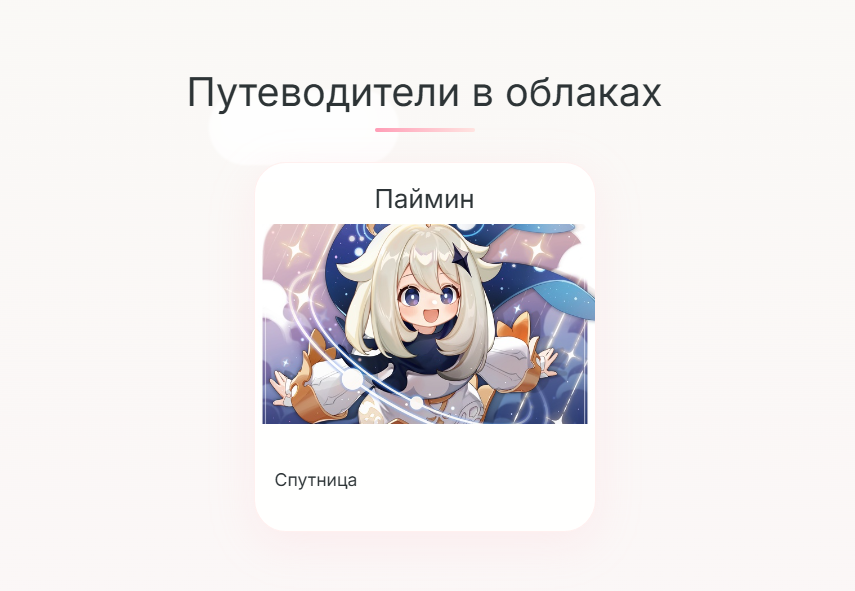
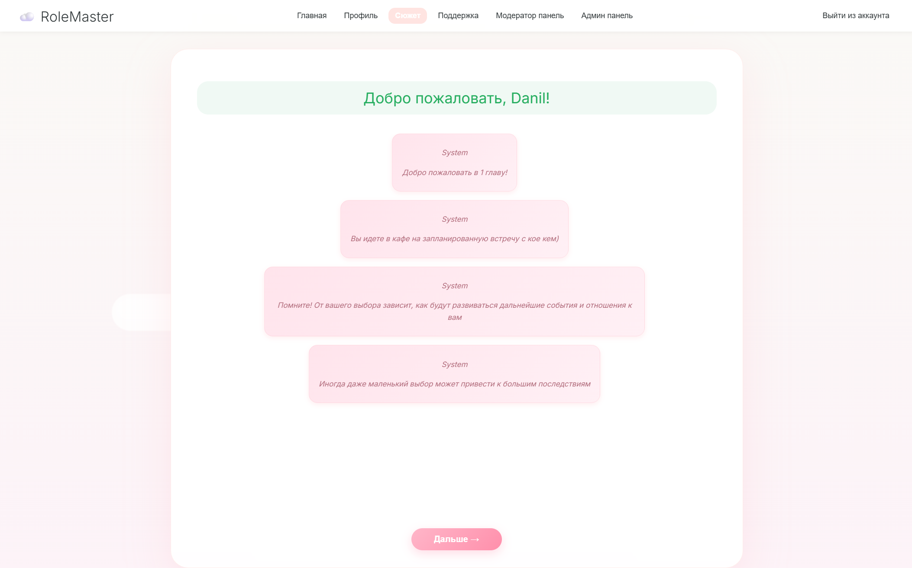
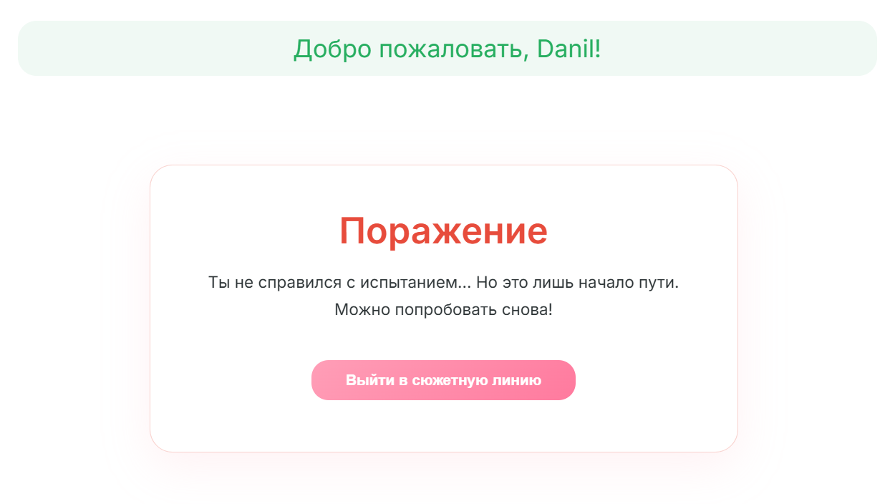
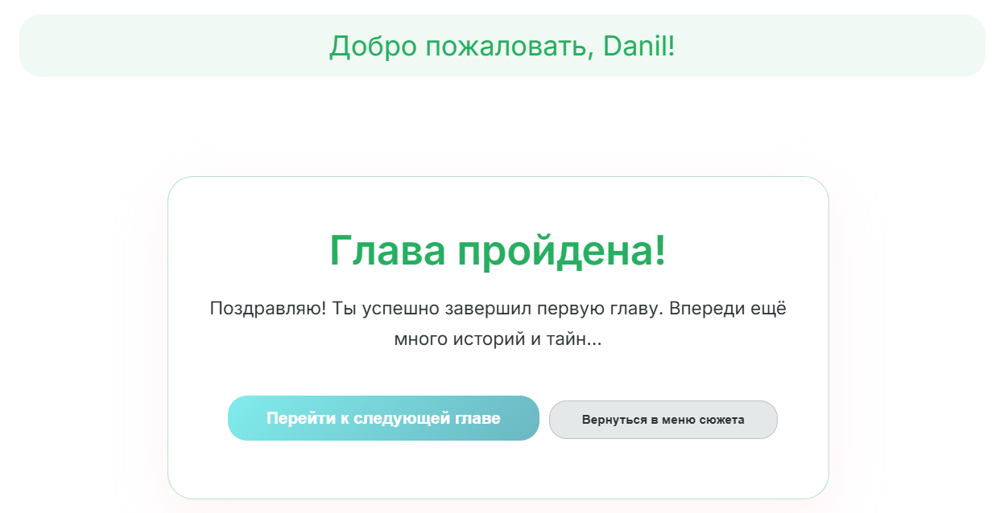

# История изменений проекта.

### 1.0.0 Публикация
- Реализована страница регистирации, входа, профиля, главной страницы и страниц Админ-панели (Админ панель, смена пароля у игрока, обновление данных игрока)

### 1.1.0 Обновление
- Добавлена страница поддержка
- Все обращения отправленные в поддержку отображаются в админ-панели самой последней таблицей
- Изменена сущность users. Добавлен опыт
- Добавлена папка `admin` в `templates`, в которой хранятся все страницы, что относятся к админ-панели: `admin`, `changePassword`, `updateUser`
- Немного отредактирован текст на сайте
- Добавлена страница сюжет с главами, которым игрокам предстоит пройти
- Добавлена сущность `MessageSupport`
- Добавлен Enum status для обращений.
    - NEW - новое обращение.
    - REJECTED - отмененное обращение.
    - IN_PROGRESS - обращение находится на рассмотрении.
    - CLOSED - обращение закрыто с ответом.

### Публикация сюжета 1 главы и небольшие исправления
- На главной странице теперь отображаются только гиды 

- Добавлен sql файл в проект. Расположение -> `src/main/resources/database/gameDb.sql`
- Обновленный дизайн игры 

- Если игрок проигрывает, то видит следующее 

- При успешном окончании игры видит 

- Исправлен баг в chapter1.js, когда истекала сессия, то продолжать играть было невозможно